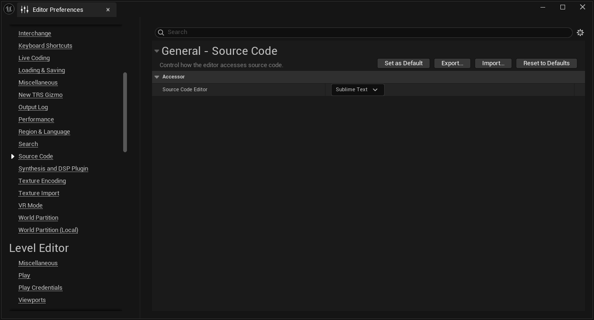

# Sublime Source Code Access

This plugin adds support to Unreal Engine for accessing source code via Sublime Text. Support includes jumping to individual file, line, and column.

Adapted from the N10XSourceCodeAccess plugin bundled with Unreal.

## Installation

Simply clone this repository into your project's `Plugins/` folder and rebuild your editor.
